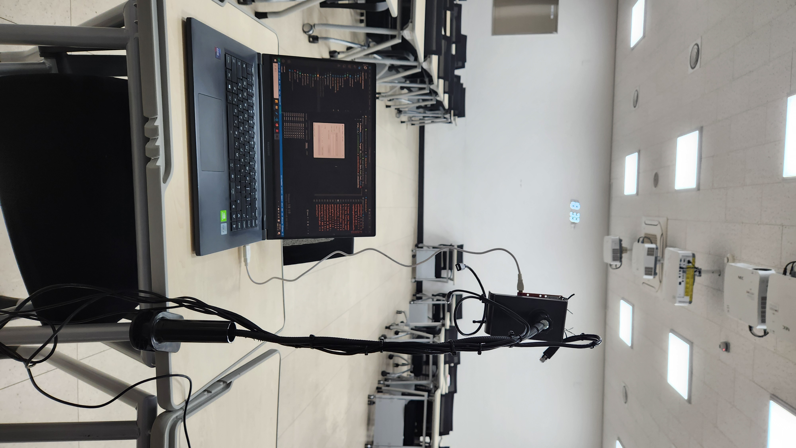

# 11/13 데이터 수집
11/13(수) IT5 2층 강의실에서 데이터 수집 진행

## 진행환경

* 강의실에 공간 만들어 각 시나리오 별 센서 데이터 수집
* cfg에 수집 상황에 맞는 세팅값 넣어 진행
    * [파일](../../../src/cfg/class_table.cfg)

## 캡쳐 시나리오
* 혼자서 움직이는 상황
* 여러 명이서 움직이는 상황
* 눕는 상황
    * 가까이, 왼쪽
    * 가까이, 오른쪽
    * 멀리, 가운데
* 의자에 앉는 상황
    * 가까이, 왼쪽
    * 가까이, 오른쪽
    * 멀리, 가운데
* 낙상
    * 다양한 낙상 포즈 시도
* 여러 상황이 혼재된 시나리오